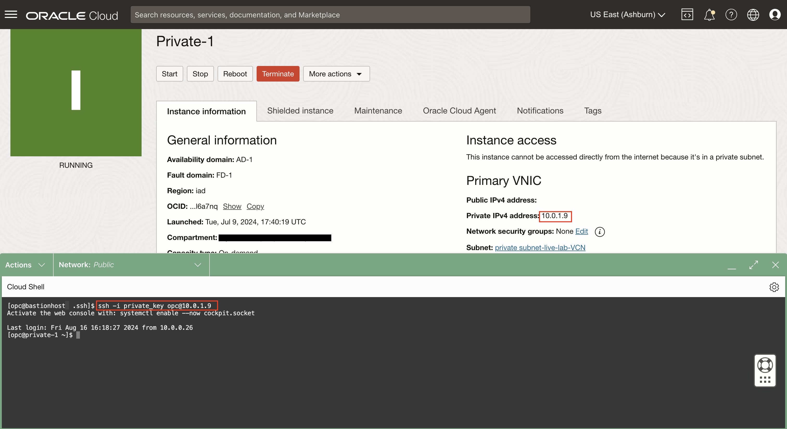

# Connect to Compute Instances

## Introduction

This lab walks you through connecting to the Bastion Host and then using that host as a jump server to access the private instance. 

Estimated Lab Time: 10 minutes

### About Bastion Host

In this lab we will see how the BastionHost acts as a jump host. Once connected to the Bastion Host you will upload the SSH keys to be able to access the private insance created in the Lab 1. This will allow 

### Objectives


In this lab, you will:
* SSH into bastion host compute instance 
* SSH into private compute instance through bastion host instance


### Prerequisites 

This lab assumes you have:
* An Oracle Cloud account
* All previous labs successfully completed
* Private SSH key generated in Lab 1


Task 1: SSH into instances


1. Open Cloud Shell

	

2. Navigate to ssh folder within Cloud Shell 

```
<copy>
cd .ssh 
</copy>
```

3. SSH into Bastion Host to ensure connection.  <br><br>
*be sure to replace text found in <> with their correct values*

```
<copy>
ssh -i <private_ssh_key> opc@<BastionHost_public_ip_address> 
</copy>
```

  
4. Update SSH key for BastionHost 

Navigate to SSH files

```
<copy>
cd .ssh
</copy>
```

Create a new file called private_key

```
<copy>
vim private_key
</copy>
```

Paste the private key generated in Lab 1

Save the changes made to private_key file 
hit esc key followed by the command bellow 

```
<copy>
:wq!
</copy>
```
hit the Return key

You can use the command **ls** to check to make sure the new file exists 


5. SSH into private instance through Bation Host <br><br>
*be sure to replace the private ip address with the actual IP address for your instance*

```
<copy>
ssh -i private_key opc@<private-1_private_ip_address> 
</copy>
```

You should now see that you have successfully navigated to the instnace private-1 




## Learn More


* Learn about self service Bastion vs Bastion as a Service [here](https://blogs.oracle.com/ateam/post/simplify-secure-access-to-oracle-workloads-using-bastions)


## Acknowledgements
* **Authors** - Olivia Maxwell, Cloud Engineer; Taylor Rees, Cloud Engineer
* **Last Updated By/Date** - Taylor Rees, August 2024
