# Create Public & Private Compute Instances

## Introduction

In this lab you will create your Public and Private compute instances. The Public instance will be your BastionHost, that you will later withing the lab, secure SSH access to. We will walk you through creating these instances using the OCI console.

Estimated Time: 15 minutes

### Oracle Compute Instances
A compute instance is a virtual machine (VM), which is an independent computing environment that runs on top of physical hardware. When you create a compute instance, you can select the most appropriate type of compute instance for your applications based on characteristics such as number of CPUs, amount of memory, and network resources. After you create a compute instance, you can access it securely from your computer, restart it, attach and detach volumes, and delete it when you're done with it. 

To learn more about Oracle's Compute Instances, review the documentation [here.](https://docs.oracle.com/en-us/iaas/compute-cloud-at-customer/topics/compute/compute-instances.htm#:~:text=Compute%20Cloud%40Customer%20lets%20you,are%20isolated%20from%20each%20other.) 

### Objectives

In this lab, you will:
* Create Public Compute Instance and name it BastionHost
* Create Private Compute Instance 

### Prerequisites (Optional)

This lab assumes you have:
* An Oracle Cloud account
* All previous labs successfully completed

## Task 1: Create Public Compute Instance named BastionHost

Navigate to Compute Instances through the Oracle Cloud Console create your Public and Private Instances

1. Click on the hamburger icon  in the top left corner of the OCI console Home page. 

	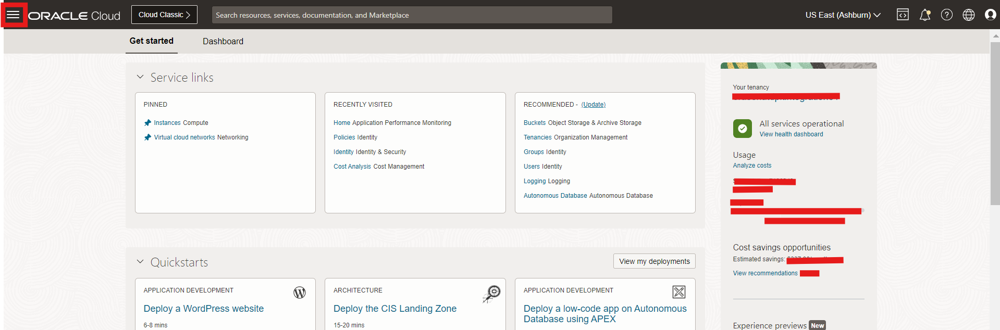

	
2. After clicking the hamburger icon , select 'Compute'. Within the Compute tab, select 'Instances'.

  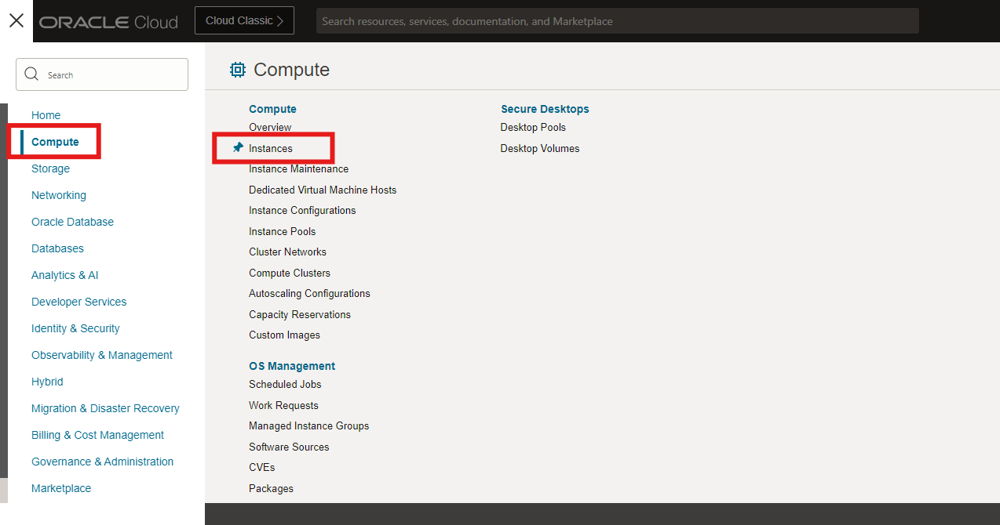

3. Before creating your Public compute instnace, you need to ensure that you are in the correct compartment. The compartment that we previously created is called 'Demo'. You can see in the picture below that we are in the correct 'Demo' compartment.

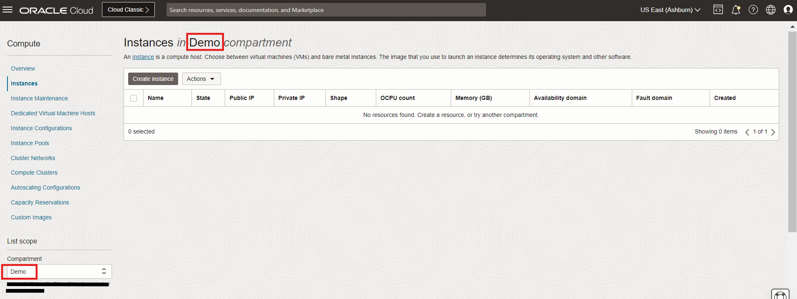

4. Click 'Create Instance'.

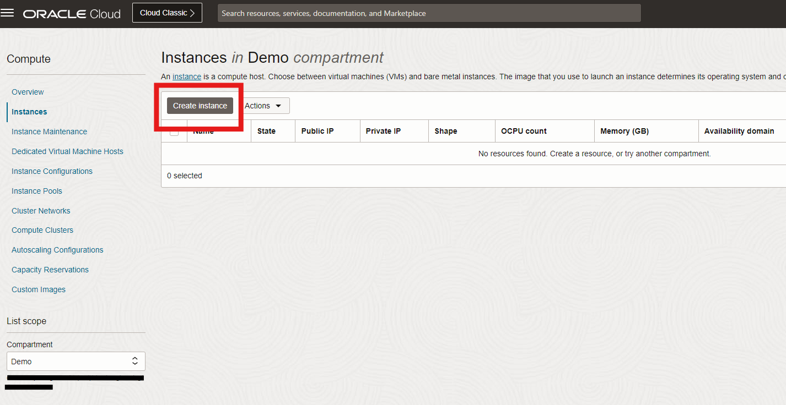

5. Create your public Bastion Host Instance. 

> Here are the customizations you will make to your instance.

* Name: BastionHost
* Compartment: Demo
* VCN: Demo_VCN
* Subnet: public subnet-Demo_VCN (regional)
* Add SSH keys: Paste public keys from Lab 1

Leave the rest as default.

>Follow the pictures below for a step-by-step guide.

Name your instance 'BastionHost':

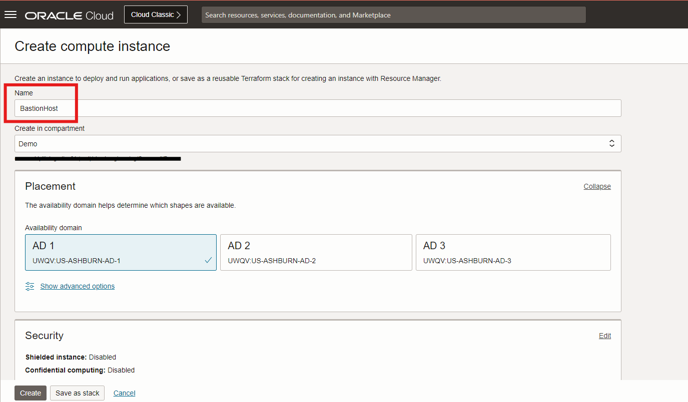

Ensure you are creating your compartment in your 'Demo' compartment:

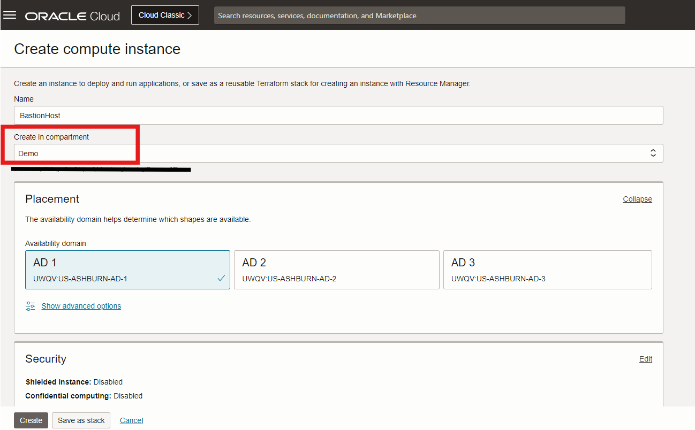

Ensure you are creating your instance in your Demo_VCN you created in Lab 2:

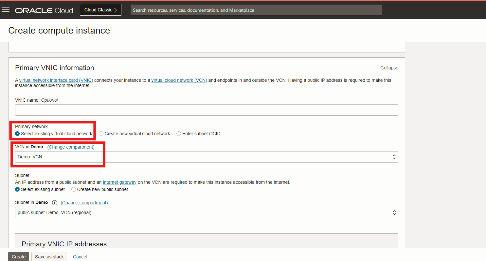

Ensure you are creating your instance in your public subnet from Lab 2:

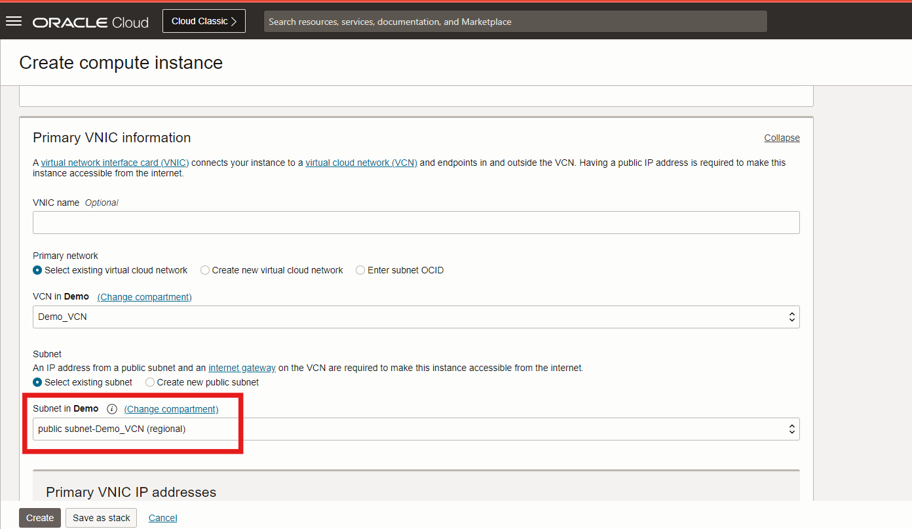

Click 'Paste public keys'. Paste your public SSH key that you generated from Lab 1:

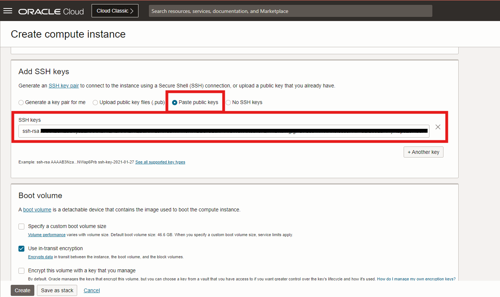

Now click the 'Create' button at the bottom left of your screen to create the instnace:

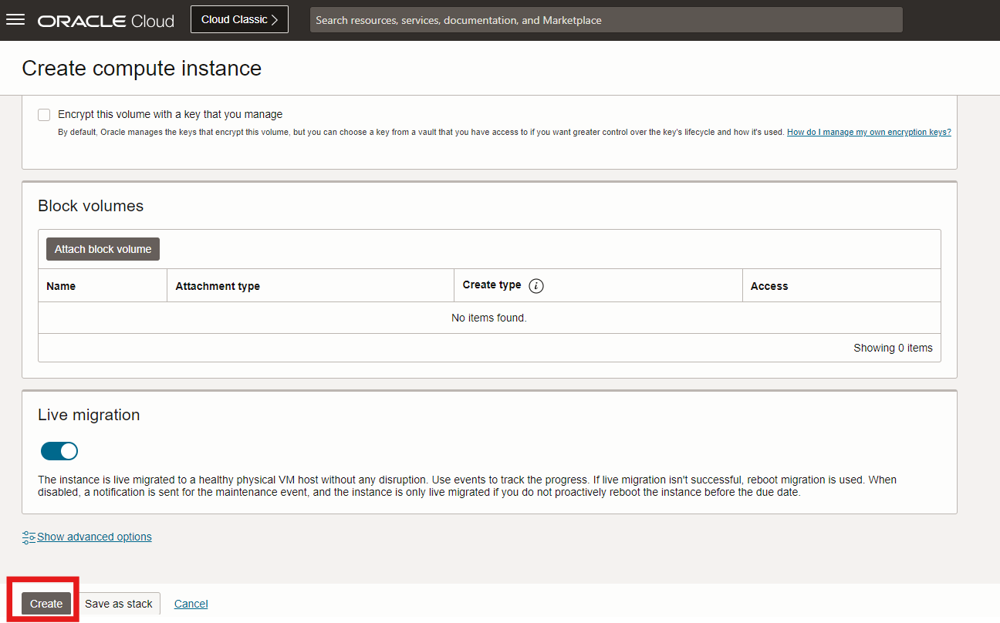

Ensure your Instance is active by seeing the box has turned green & says 'RUNNING' underneath:

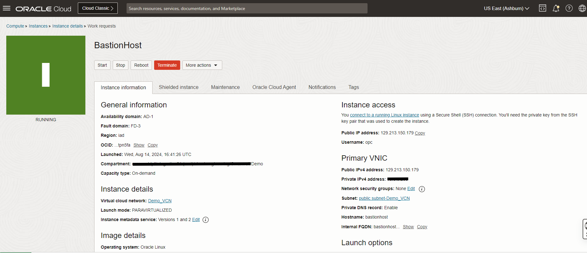

## Task 2: Create your private instance.

1. Navigate back to the Oracle Instances page. Click 'Create Instance' button to start creating your private instnace.

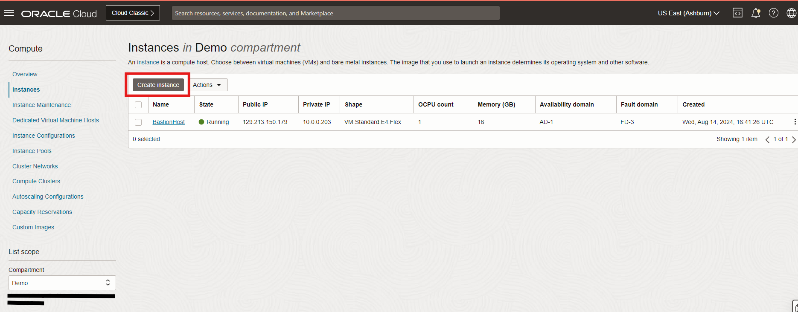

>* Refer to Task 1, Steps 1-2 to navigate back to the Oracle Instnaces Page

2. Create your private instance

> Here are the customizations you will make to your instance.

* Name: private-1
* Compartment: Demo
* VCN: Demo_VCN
* Subnet: private subnet-Demo_VCN (regional)
* Add SSH keys: Paste public keys from Lab 1

Leave the rest as default.

>Follow the pictures below for a step-by-step guide.

Name your instance 'private-1':

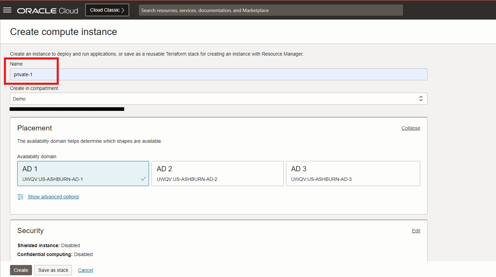

Ensure you are creating your compartment in your 'Demo' compartment:

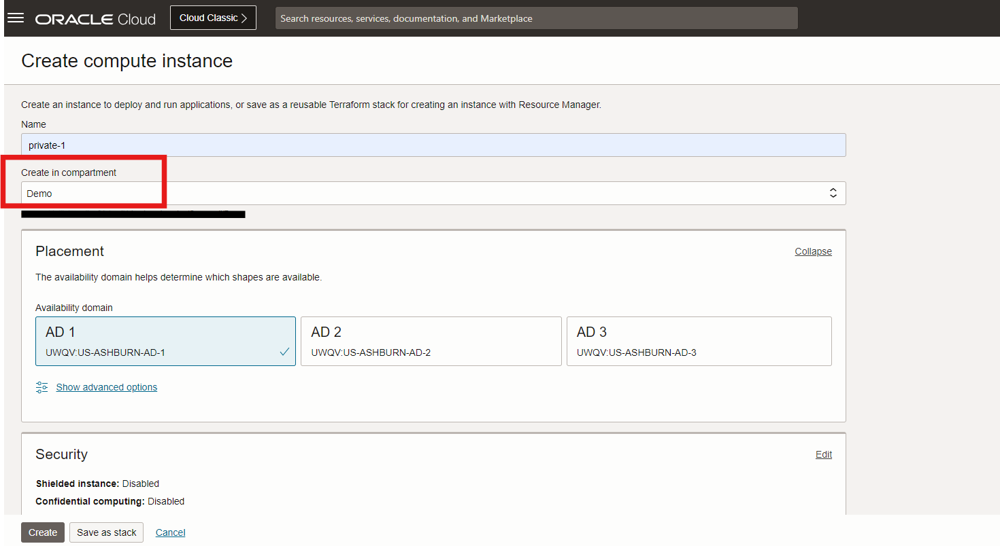

Ensure you are creating your instance in your Demo_VCN you created in Lab 2:

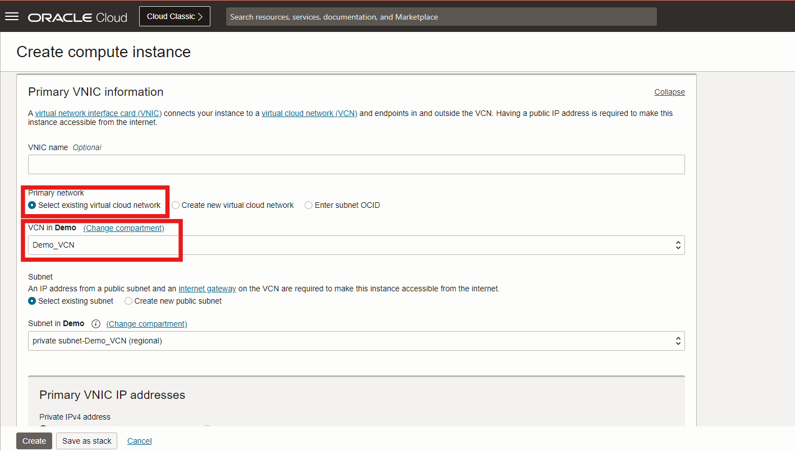

Ensure you are creating your instance in your private subnet from Lab 2:

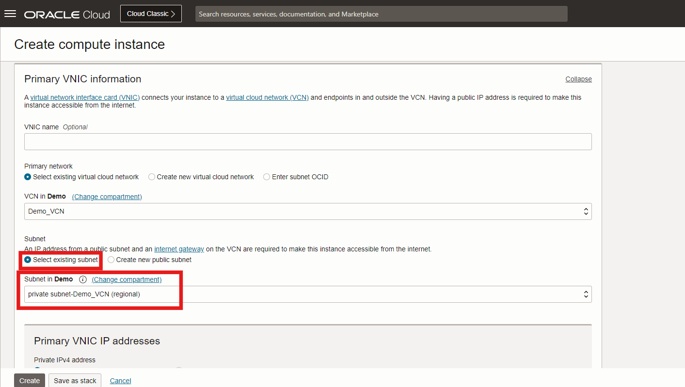

Click 'Paste public keys'. Paste your public SSH key that you generated from Lab 1:

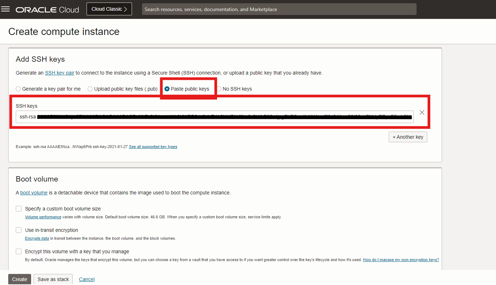

Now click the 'Create' button at the bottom left of your screen to create the instance:

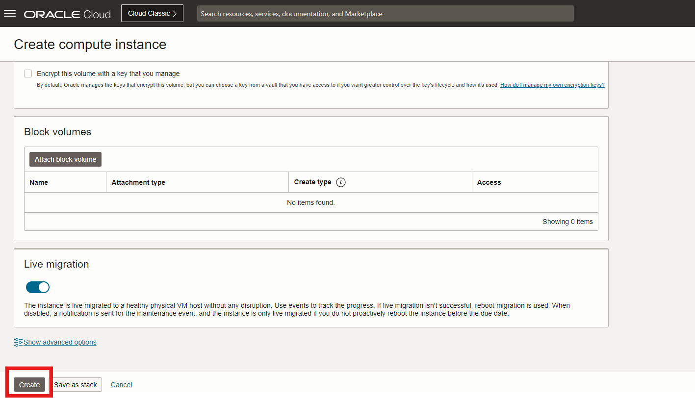

Ensure your Instance is active by seeing the box has turned green & says 'RUNNING' underneath:

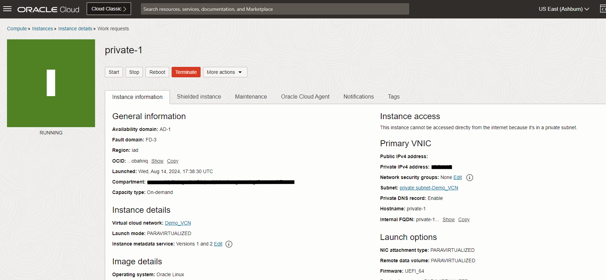

You may now **proceed to the next lab.**

## Learn More

* Learn more about compute intances [here.](https://docs.oracle.com/en-us/iaas/Content/Compute/Concepts/computeoverview.htm)

## Acknowledgements
* **Authors** - Olivia Maxwell, Cloud Engineer; Taylor Rees, Cloud Engineer
* **Last Updated By/Date** -Olivia Maxwell, August 2024
