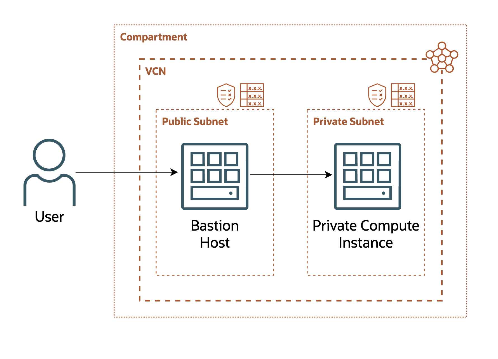

# Introduction

## About this Workshop

A Bastion Host acts as a single point of controlled access for authorized users. The Bastion host becomes the only ingress path to internal sources to simplify security administration. This lab will show how easy it is to set up a Bastion Host an connect to a private instance. 

  

Estimated Workshop Time: 1 hour 

### Objectives

In this workshop, you will learn how to:
* Generate SSH keys
* Create a compartment
* Create virtual cloud networks
* Create compute instances
* Use a BastionHost to access a private compute instance

### Prerequisites (Optional)
* An Oracle Cloud Account 

## Learn More

## Acknowledgements
* **Authors** - Olivia Maxwell, Cloud Engineer; Taylor Rees, Cloud Engineer
* **Last Updated By/Date** - Taylor Rees, August 2024

